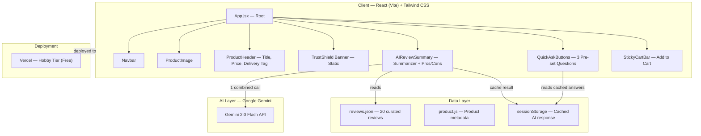
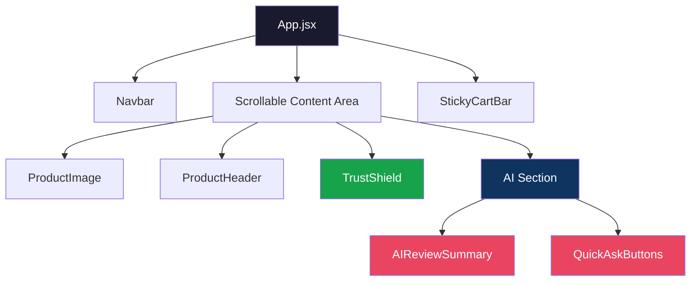
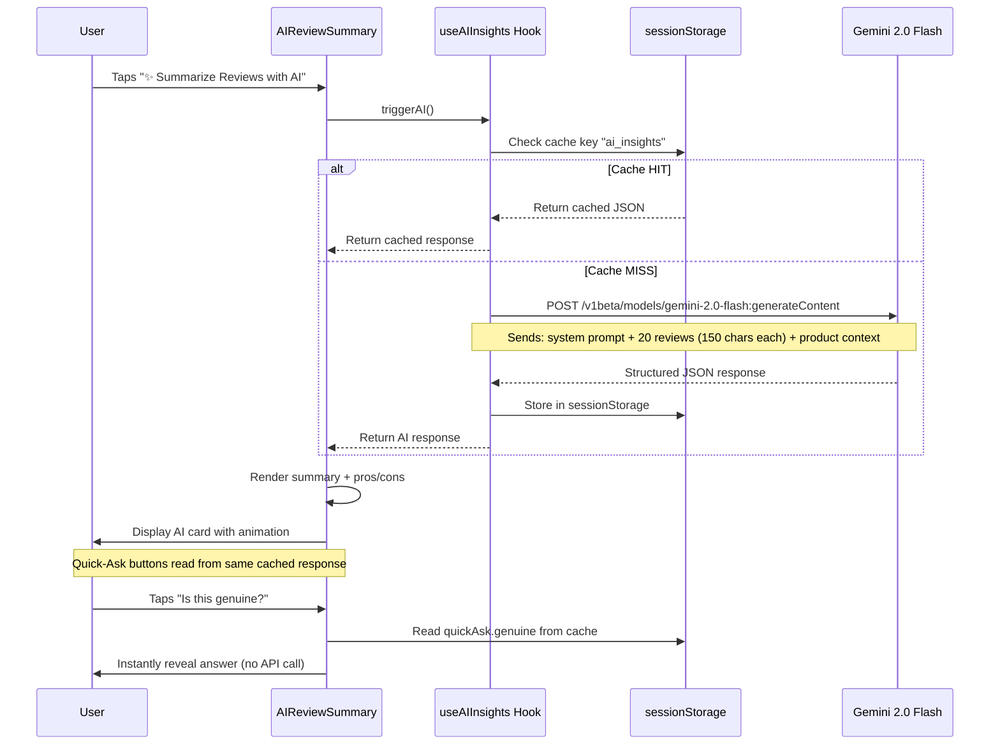
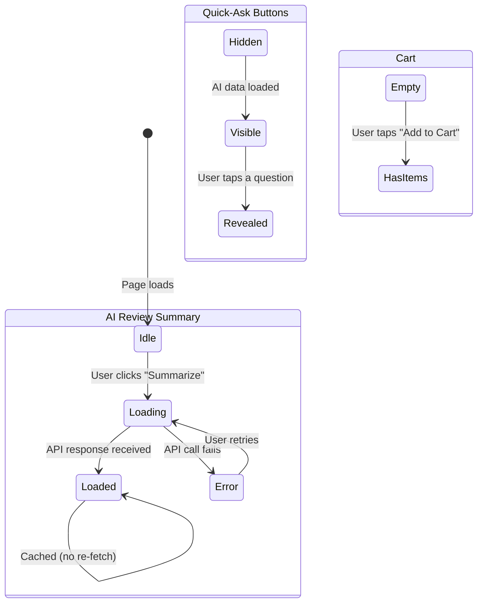
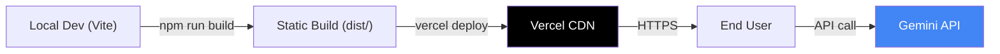

# Architecture — Blinkit TrustShield + AI Review Intelligence

## System Overview



---

## Directory Structure

```
d:/MVP/
├── docs/
│   ├── problemStatement.md         # Problem context & research
│   └── architecture.md             # This file
├── public/
│   └── images/
│       └── boat-airdopes-141.png   # Product image
├── src/
│   ├── assets/
│   │   └── icons/                  # SVG icons (cart, search, back, shield, etc.)
│   ├── components/
│   │   ├── Navbar.jsx              # Top bar: Back, Search, Cart
│   │   ├── ProductImage.jsx        # Product image with gallery dots
│   │   ├── ProductHeader.jsx       # Title, price, delivery tag, ratings
│   │   ├── TrustShield.jsx         # Static trust banner (authenticity + returns)
│   │   ├── AIReviewSummary.jsx     # "Summarize with AI" button + result card
│   │   ├── QuickAskButtons.jsx     # 3 pre-set question buttons + answers
│   │   └── StickyCartBar.jsx       # Fixed bottom "Add to Cart" button
│   ├── data/
│   │   ├── reviews.json            # 20 curated mock reviews
│   │   └── product.js              # Product metadata (name, price, specs)
│   ├── services/
│   │   └── gemini.js               # Gemini API client + prompt builder
│   ├── hooks/
│   │   └── useAIInsights.js        # Custom hook: fetch + cache AI response
│   ├── utils/
│   │   └── cache.js                # sessionStorage read/write helpers
│   ├── App.jsx                     # Root component — assembles PDP layout
│   ├── App.css                     # Global + component styles (Tailwind)
│   ├── index.css                   # Tailwind base imports
│   └── main.jsx                    # Vite entry point
├── .env                            # VITE_GEMINI_API_KEY
├── index.html                      # HTML shell
├── package.json
├── postcss.config.js
├── tailwind.config.js
├── vite.config.js
└── vercel.json                     # Vercel deployment config
```

---

## Component Architecture

### Component Tree & Responsibilities



### Component Details

| Component | Type | Props | State | AI? |
|-----------|------|-------|-------|-----|
| `Navbar` | Static | — | — | No |
| `ProductImage` | Static | `imageSrc` | — | No |
| `ProductHeader` | Static | `product` | — | No |
| `TrustShield` | Static | — | — | No |
| `AIReviewSummary` | Interactive | `reviews` | `loading`, `aiResponse`, `isRevealed` | Yes |
| `QuickAskButtons` | Interactive | `quickAskData` | `activeQuestion` | No (uses cached data) |
| `StickyCartBar` | Static | `price` | `quantity` | No |

---

## AI Integration Architecture

### Single-Call Strategy



### Gemini API Request

**Endpoint**: `https://generativelanguage.googleapis.com/v1beta/models/gemini-2.0-flash:generateContent`

**Authentication**: API key passed as query parameter (`?key=VITE_GEMINI_API_KEY`)

**Prompt Design**:

```
System: You are a product review analyst for Blinkit, a quick-commerce platform.
Analyze the following customer reviews for the product and return a JSON response.

Product: boAt Airdopes 141 Wireless Earbuds — ₹1,499
Category: Electronics (non-grocery item on a grocery delivery platform)

Reviews:
[20 curated reviews, each ≤150 characters]

Return ONLY valid JSON in this exact format:
{
  "summary": "A 2-3 sentence overall buyer sentiment summary",
  "pros": ["pro1", "pro2", "pro3", "pro4"],
  "cons": ["con1", "con2"],
  "quickAsk": {
    "genuine": "2-3 sentence answer about product authenticity and supply chain verification on Blinkit",
    "returns": "2-3 sentence answer about Blinkit's no-questions-asked doorstep return within 48 hours",
    "worthIt": "2-3 sentence answer about why buying on Blinkit is worth it (speed, convenience, returns) — do NOT compare prices with competitors"
  }
}
```

### Token Budget

| Component | Tokens |
|-----------|--------|
| System prompt + instructions | ~200 |
| Product context | ~50 |
| 20 reviews × ~40 tokens each | ~800 |
| JSON format instructions | ~150 |
| **Total Input** | **~1,200** |
| JSON output (summary + pros/cons + 3 answers) | **~400** |
| **Total per session** | **~1,600** |
| Safety margin (2.5×) | **~4,000** |

> **Free tier capacity**: 1,000,000 tokens/day ÷ 4,000 = **~250 sessions/day**

---

## Data Layer

### `reviews.json` — Mock Review Dataset

20 curated reviews simulating real Blinkit buyer feedback. Each review is structured as:

```json
{
  "id": 1,
  "author": "Rahul M.",
  "rating": 5,
  "date": "2026-07-15",
  "text": "Amazing sound quality and fast delivery! Got it in 8 minutes. 100% genuine product with warranty card.",
  "verified": true
}
```

**Curation criteria**:
- Mix of positive (14), neutral (3), and negative (3) reviews
- Cover key themes: sound quality, delivery speed, authenticity, price value, returns
- Each `text` field ≤ 150 characters
- Realistic Indian names and Blinkit-specific language

### `product.js` — Product Metadata

```javascript
export const product = {
  name: "boAt Airdopes 141 Wireless Earbuds",
  price: 1499,
  mrp: 2999,
  discount: 50,
  rating: 4.2,
  reviewCount: 1420,
  deliveryTime: "10 minutes",
  category: "Electronics & Accessories",
  brand: "boAt",
  highlights: [
    "Bluetooth 5.1",
    "42H Total Playback",
    "IPX4 Water Resistant",
    "Low Latency Mode"
  ],
  image: "/images/boat-airdopes-141.png"
};
```

---

## Caching Strategy

### sessionStorage Schema

```javascript
// Key: "blinkit_ai_insights"
// Value: JSON string
{
  "timestamp": 1722380400000,        // When the response was generated
  "productId": "boat-airdopes-141",  // Cache per product
  "data": {
    "summary": "...",
    "pros": ["...", "..."],
    "cons": ["...", "..."],
    "quickAsk": {
      "genuine": "...",
      "returns": "...",
      "worthIt": "..."
    }
  }
}
```

### Cache Lifecycle

| Event | Action |
|-------|--------|
| User clicks "Summarize" (no cache) | Call Gemini → store result in `sessionStorage` |
| User clicks "Summarize" (cache exists) | Read from `sessionStorage` → skip API call |
| User taps Quick-Ask button | Read from `sessionStorage` → instant reveal |
| User closes tab / browser | `sessionStorage` is cleared automatically |
| User opens in new tab | Fresh API call (new session) |

---

## UI/UX Specifications

### Layout

```
┌──────────────────────────────┐
│  ← Back    🔍 Search    🛒  │  ← Navbar (fixed top)
├──────────────────────────────┤
│                              │
│     [ Product Image ]        │  ← ProductImage
│         • • • ○ ○            │
│                              │
├──────────────────────────────┤
│  ⚡ Delivery in 10 mins      │  ← Delivery tag
│  boAt Airdopes 141           │  ← ProductHeader
│  ₹1,499  ₹2,999  50% off    │
│  ★★★★☆  1,420 ratings       │
├──────────────────────────────┤
│  ┌────────────────────────┐  │
│  │ 🛡️ Brand Authorized    │  │  ← TrustShield
│  │ 📦 Easy Doorstep Return│  │
│  └────────────────────────┘  │
├──────────────────────────────┤
│  What Buyers Are Saying      │  ← AIReviewSummary
│  [✨ Summarize with AI]      │
│                              │
│  (After click:)              │
│  ┌────────────────────────┐  │
│  │ ✨ AI Summary Card      │  │
│  │ "Based on 1,420..."     │  │
│  │ 👍 Pros  │  👎 Cons     │  │
│  └────────────────────────┘  │
├──────────────────────────────┤
│  Ask About This Product      │  ← QuickAskButtons
│  [🛡️ Genuine?] [📦 Returns?]│
│  [💰 Worth It?]            │
├──────────────────────────────┤
│                              │
│                              │
├──────────────────────────────┤
│  [🛒 Add to Cart — ₹1,499]  │  ← StickyCartBar (fixed bottom)
└──────────────────────────────┘
```

### Design Tokens

| Token | Value | Usage |
|-------|-------|-------|
| `--blinkit-yellow` | `#F8CB46` | Primary CTA, highlights |
| `--blinkit-green` | `#0C831F` | Delivery tag, trust signals |
| `--trust-bg` | `#ECFDF5` | TrustShield banner background |
| `--ai-purple` | `#7C3AED` | AI feature accent (summary card border, button) |
| `--text-primary` | `#1F2937` | Headings, product title |
| `--text-secondary` | `#6B7280` | Descriptions, metadata |
| `--surface` | `#FFFFFF` | Card backgrounds |
| `--border` | `#E5E7EB` | Card borders, dividers |
| `--shadow-card` | `0 1px 3px rgba(0,0,0,0.1)` | Card elevation |
| `--radius-card` | `12px` | Card corner radius |
| `--font-family` | `'Inter', system-ui, sans-serif` | All text |

### Responsive Behavior

| Breakpoint | Behavior |
|------------|----------|
| **≤ 480px** (mobile) | Full-width, native app feel |
| **> 480px** (desktop) | `max-width: 480px`, centered, with `box-shadow` to simulate phone viewport |

---

## State Management

No external state library needed — React `useState` + `useRef` is sufficient for this single-page MVP.

### State Map



| State Variable | Component | Type | Initial |
|---------------|-----------|------|---------|
| `aiResponse` | `useAIInsights` | `object \| null` | `null` |
| `loading` | `useAIInsights` | `boolean` | `false` |
| `error` | `useAIInsights` | `string \| null` | `null` |
| `activeQuestion` | `QuickAskButtons` | `string \| null` | `null` |
| `cartCount` | `StickyCartBar` | `number` | `0` |

---

## Error Handling

| Scenario | Handling |
|----------|----------|
| Gemini API key missing | Show inline warning: "AI features unavailable — API key not configured" |
| Gemini API rate limited (429) | Show retry button with message: "AI is busy, tap to try again" |
| Gemini returns malformed JSON | Fallback to hardcoded summary (graceful degradation) |
| Network offline | Detect with `navigator.onLine`, show offline badge |
| sessionStorage unavailable | Skip caching, make fresh API call each time |

---

## Security Considerations

| Concern | Mitigation |
|---------|------------|
| API key exposure in client | Acceptable for MVP/demo. For production: move to Vercel serverless function (`/api/ai-insights`) |
| Prompt injection via reviews | Reviews are static mock data (bundled JSON), not user-generated. No injection vector. |
| XSS in AI output | Render AI responses as text only (no `dangerouslySetInnerHTML`). React auto-escapes by default. |

---

## Deployment Architecture



| Step | Command |
|------|---------|
| Install dependencies | `npm install` |
| Run locally | `npm run dev` |
| Build for production | `npm run build` |
| Deploy to Vercel | `vercel` |

### Environment Variables

| Variable | Description | Where |
|----------|-------------|-------|
| `VITE_GEMINI_API_KEY` | Google Gemini API key | `.env` (local) + Vercel dashboard (production) |
