# Implementation Plan — Blinkit TrustShield + AI Review Intelligence

> **Total Phases**: 5  
> **Estimated Time**: 4–5 hours  
> **References**: [problemStatement.md](file:///d:/MVP/docs/problemStatement.md) · [architecture.md](file:///d:/MVP/docs/architecture.md)

---

## Phase 0: Project Scaffolding & Configuration ✅

> **Goal**: Set up the React + Vite + Tailwind CSS project with all config files, folder structure, and environment variables.  
> **Duration**: ~20 minutes

### Tasks

| # | Task | File(s) | Details |
|---|------|---------|---------|
| 0.1 | Scaffold Vite + React project | `package.json`, `vite.config.js`, `index.html` | `npx -y create-vite@latest ./ --template react` |
| 0.2 | Install Tailwind CSS + PostCSS | `tailwind.config.js`, `postcss.config.js` | `npm install -D tailwindcss @tailwindcss/vite` |
| 0.3 | Configure Tailwind | `tailwind.config.js` | Add `content` paths, extend theme with design tokens (`--blinkit-yellow`, `--blinkit-green`, `--ai-purple`, etc.) |
| 0.4 | Set up `index.css` | `src/index.css` | Tailwind directives (`@tailwind base/components/utilities`) + CSS custom properties for design tokens |
| 0.5 | Create folder structure | `src/components/`, `src/data/`, `src/services/`, `src/hooks/`, `src/utils/` | Empty directories matching architecture |
| 0.6 | Create `.env` file | `.env` | `VITE_GEMINI_API_KEY=<key>` placeholder |
| 0.7 | Create `vercel.json` | `vercel.json` | SPA rewrite rule: `{ "rewrites": [{ "source": "/(.*)", "destination": "/index.html" }] }` |
| 0.8 | Add Google Fonts (Inter) | `index.html` | `<link>` tag for Inter font family |
| 0.9 | Verify dev server runs | — | `npm run dev` → blank page loads without errors |

### Deliverable
- Project boots with `npm run dev`
- Tailwind utility classes compile correctly
- Folder structure matches [architecture.md](file:///d:/MVP/docs/architecture.md#L52-L91)

---

## Phase 1: Data Files & Static UI Components ✅

> **Goal**: Create mock data files and build all static (non-AI) components.  
> **Duration**: ~60 minutes  
> **Depends on**: Phase 0 complete

### Phase 1A — Data Files

| # | Task | File | Details |
|---|------|------|---------|
| 1A.1 | Create product metadata | `src/data/product.js` | Export `product` object: name, price, MRP, discount, rating, reviewCount, deliveryTime, highlights, image path. |
| 1A.2 | Create mock reviews dataset | `src/data/reviews.json` | 20 curated reviews (14 positive, 3 neutral, 3 negative). Each: `id`, `author`, `rating`, `date`, `text` (≤150 chars), `verified`. |
| 1A.3 | Generate product image | `public/images/boat-airdopes-141.png` | Generate a clean product image of wireless earbuds using the image generation tool |

### Phase 1B — Static Components

Build components in **dependency order** (leaf components first, root last):

| # | Component | File | Props | Notes |
|---|-----------|------|-------|-------|
| 1B.1 | `Navbar` | `src/components/Navbar.jsx` | — | Fixed top bar. Back arrow (←), search icon (🔍), cart icon (🛒) with badge. Blinkit yellow background. |
| 1B.2 | `ProductImage` | `src/components/ProductImage.jsx` | `imageSrc` | Full-width product image with gallery indicator dots below. Light gray background. |
| 1B.3 | `ProductHeader` | `src/components/ProductHeader.jsx` | `product` | Delivery tag ("⚡ 10 mins"), product name, price (₹1,499), MRP strikethrough (₹2,999), discount badge (50% off), star rating, review count, product highlights as chips. |
| 1B.4 | `TrustShield` | `src/components/TrustShield.jsx` | — | Light green (`#ECFDF5`) banner. Two rows: "🛡️ Brand Authorized · Verified Supply Chain" + "📦 Easy Doorstep Return · No Questions Asked (48 hrs)". Subtle shield icon. Border-left accent in green. |
| 1B.5 | `StickyCartBar` | `src/components/StickyCartBar.jsx` | `price` | Fixed bottom bar. Quantity selector (−/+). "Add to Cart — ₹1,499" button in Blinkit yellow. `cartCount` state. |
| 1B.6 | Assemble `App.jsx` | `src/App.jsx` | — | Import all components. Wrap in `max-w-[480px] mx-auto shadow-xl` container. Add padding-bottom for sticky cart bar. |

### Deliverable
- Full PDP visible in browser at `localhost:5173`
- All static components render correctly
- Mobile viewport simulation works on desktop
- Sticky navbar (top) and cart bar (bottom) behave correctly

---

## Phase 2: AI Integration — Gemini Service + Caching ✅

> **Goal**: Build the Gemini API client, prompt builder, caching layer, and custom React hook.  
> **Duration**: ~45 minutes  
> **Depends on**: Phase 1A complete (data files needed for prompt)

### Tasks

| # | Task | File | Details |
|---|------|------|---------|
| 2.1 | Build cache utilities | `src/utils/cache.js` | Two functions: `getCachedInsights(productId)` and `setCachedInsights(productId, data)`. Uses `sessionStorage` with key `blinkit_ai_insights`. |
| 2.2 | Build Gemini API client | `src/services/gemini.js` | Single export: `fetchAIInsights(product, reviews)`. Constructs the combined prompt (system + product context + 20 reviews). Calls Gemini 2.0 Flash REST API. Parses structured JSON response. Includes error handling. |
| 2.3 | Build `useAIInsights` hook | `src/hooks/useAIInsights.js` | Exposes: `{ aiResponse, loading, error, triggerAI }`. On `triggerAI()`: checks cache → if miss, calls `fetchAIInsights` → stores result → updates state. |
| 2.4 | Create fallback data | `src/data/fallback.js` | Hardcoded fallback response matching the JSON schema. Used when Gemini fails (graceful degradation). |

### Deliverable
- `fetchAIInsights()` returns valid JSON from Gemini when called manually in browser console
- Cache hit/miss works correctly (verified via DevTools → Application → Session Storage)
- Fallback data renders when API key is missing or invalid

---

## Phase 3: AI-Powered Interactive Components ✅

> **Goal**: Build the two AI-driven components (`AIReviewSummary` + `QuickAskButtons`) and wire them to the hook.  
> **Duration**: ~60 minutes  
> **Depends on**: Phase 1B + Phase 2 complete

### Phase 3A — AIReviewSummary Component

| # | Task | Details |
|---|------|---------|
| 3A.1 | **Idle state** | Section header "What Buyers Are Saying". CTA button: "✨ Summarize Reviews with AI" — styled with `--ai-purple` gradient, subtle pulse animation. |
| 3A.2 | **Loading state** | On button click → button transforms to "Analyzing 1,420 reviews..." with spinner. Skeleton loader cards pulse below (3 skeleton bars). |
| 3A.3 | **Loaded state** | AI Summary Card slides in with `translateY` animation. Shows: (a) summary paragraph with ✨ sparkle icon, (b) Pros section with 👍 green chips, (c) Cons section with 👎 amber chips. |
| 3A.4 | **Error state** | Inline error message: "Couldn't load AI summary". Retry button. |
| 3A.5 | Wire to `useAIInsights` | Call `triggerAI()` on button click. Bind `loading`, `aiResponse`, `error` to component states. |

### Phase 3B — QuickAskButtons Component

| # | Task | Details |
|---|------|---------|
| 3B.1 | **Hidden state** | Section header "Ask About This Product" — visible but buttons show "Available after AI summary" hint if AI hasn't been triggered. |
| 3B.2 | **Active state** | Three pill buttons appear once `aiResponse` is available: "🛡️ Is this genuine?", "📦 What if I don't like it?", "💰 Why is this worth it?". Subtle fade-in animation. |
| 3B.3 | **Answer reveal** | On button tap → answer card slides down below the tapped button. Card has a subtle AI sparkle border. Other answers collapse (accordion behavior). |
| 3B.4 | Wire to cached data | Read `aiResponse.quickAsk[key]` for each button. No API call. Instant reveal. |

### Phase 3C — Assemble in App.jsx

| # | Task | Details |
|---|------|---------|
| 3C.1 | Add AI section to App.jsx | Place `AIReviewSummary` below `TrustShield`. Place `QuickAskButtons` below `AIReviewSummary`. |
| 3C.2 | Pass shared state | `useAIInsights` hook called in `App.jsx`. Pass `aiResponse` to both `AIReviewSummary` and `QuickAskButtons`. |
| 3C.3 | Ensure scroll behavior | Content scrolls naturally between fixed navbar and sticky cart bar. AI section expandable without breaking layout. |

### Deliverable
- "Summarize with AI" button triggers real Gemini API call
- Loading skeleton appears for ~1-2 seconds while API responds
- AI summary + pros/cons card reveals with smooth animation
- Quick-Ask buttons instantly reveal cached answers
- Error state shows retry button on API failure
- Full flow works end-to-end

---

## Phase 4: Polish, Animations & Responsive Testing ✅

> **Goal**: Refine visual quality, add micro-animations, ensure pixel-perfect mobile experience.  
> **Duration**: ~45 minutes  
> **Depends on**: Phase 3 complete

### Phase 4A — Visual Polish

| # | Task | Details |
|---|------|---------|
| 4A.1 | TrustShield polish | Add subtle gradient background. Shield icon with green glow. Left border accent (4px solid green). |
| 4A.2 | AI Summary card polish | Purple-to-blue gradient border on the card. "Powered by AI ✨" watermark in bottom-right corner. Glassmorphism effect on the card background. |
| 4A.3 | Typography refinement | Ensure Inter font loads. Verify font sizes: product name (18px/semibold), price (22px/bold), body (14px/regular), meta (12px/medium). |
| 4A.4 | Color consistency | Audit all colors against design tokens. |

### Phase 4B — Micro-Animations

| # | Element | Animation |
|---|---------|-----------|
| 4B.1 | "Summarize with AI" button | Subtle pulse glow when idle. Scale-down on press (`active:scale-95`). |
| 4B.2 | AI Summary card | `fadeInUp` — `opacity: 0 → 1`, `translateY: 20px → 0` over 400ms ease-out. |
| 4B.3 | Pros/Cons chips | Staggered fade-in — each chip appears 100ms after the previous. |
| 4B.4 | Quick-Ask answer reveal | `slideDown` — `max-height: 0 → auto`, `opacity: 0 → 1` over 300ms. |
| 4B.5 | Loading skeleton | Pulsing shimmer animation (`@keyframes shimmer` — gradient sweep left to right). |
| 4B.6 | Add to Cart button | Bounce effect when quantity changes. |

### Phase 4C — Responsive & Cross-Browser Testing

| # | Test | Expected Result |
|---|------|-----------------|
| 4C.1 | Mobile viewport (375px) | Full-width, no horizontal scroll, touch-friendly tap targets (≥44px). |
| 4C.2 | Desktop viewport (1440px) | Centered 480px container with card shadow. Surrounding area is subtle gray. |
| 4C.3 | Sticky elements | Navbar stays fixed at top. Cart bar stays fixed at bottom. Content scrolls between them. |
| 4C.4 | Long AI response | Summary card expands gracefully. No overflow or clipping. |
| 4C.5 | No API key scenario | Warning message appears. Static content still works. TrustShield still renders. |
| 4C.6 | Slow network (3G throttle) | Loading skeleton remains visible. No flash of empty content. |

### Deliverable
- UI matches the wireframe
- All animations are smooth (60fps, no jank)
- Mobile and desktop layouts both look polished
- Edge cases handled gracefully

---

## Phase 5: Build, Deploy & Verify ✅

> **Goal**: Production build, Vercel deployment, live URL verification.  
> **Duration**: ~20 minutes  
> **Depends on**: Phase 4 complete

### Tasks

| # | Task | Command / Action | Details |
|---|------|------------------|---------|
| 5.1 | Production build | `npm run build` | Verify `dist/` folder is generated. Check bundle size (target: < 200KB gzipped). |
| 5.2 | Preview production build | `npm run preview` | Test locally with production bundle. Verify all features work. |
| 5.3 | Set env variable on Vercel | Vercel Dashboard → Settings | Add `VITE_GEMINI_API_KEY`. |
| 5.4 | Deploy to Vercel | `vercel` | Follow CLI prompts. Get production URL. |
| 5.5 | Verify live deployment | Browser | Open production URL. Test full flow. |
| 5.6 | Test on real mobile device | Phone browser | Open production URL. Verify interactions. |

### Verification Checklist

| Check | Pass Criteria |
|-------|---------------|
| ✅ Page loads | PDP renders with all static components in < 2 seconds |
| ✅ TrustShield visible | Trust badges appear below product header without scrolling |
| ✅ AI Summarizer works | Gemini returns valid JSON. Summary + pros/cons render correctly. |
| ✅ Quick-Ask works | All 3 buttons reveal instant answers from cache |
| ✅ Caching works | Second click on "Summarize" uses cache |
| ✅ Error fallback | Temporarily invalid API key → fallback summary renders |
| ✅ Mobile responsive | Tested on 375px and 480px viewports |

---

## Phase Summary

```mermaid
gantt
    title Implementation Timeline
    dateFormat HH:mm
    axisFormat %H:%M

    section Phase 0
    Scaffolding & Config          :done, p0, 00:00, 20m

    section Phase 1
    Data Files (1A)               :p1a, after p0, 20m
    Static Components (1B)        :p1b, after p1a, 40m

    section Phase 2
    Cache Utilities                :p2a, after p1a, 10m
    Gemini Service                 :p2b, after p2a, 20m
    useAIInsights Hook             :p2c, after p2b, 15m

    section Phase 3
    AIReviewSummary Component      :p3a, after p1b, 30m
    QuickAskButtons Component      :p3b, after p3a, 20m
    Wire to App.jsx                :p3c, after p3b, 10m

    section Phase 4
    Visual Polish                  :p4a, after p3c, 20m
    Micro-Animations               :p4b, after p4a, 15m
    Responsive Testing             :p4c, after p4b, 10m

    section Phase 5
    Build & Deploy                 :p5, after p4c, 20m
```

| Phase | Duration | Cumulative |
|-------|----------|------------|
| Phase 0 — Scaffolding | ~20 min | 0:20 (Done) |
| Phase 1 — Data + Static UI | ~60 min | 1:20 |
| Phase 2 — AI Service + Cache | ~45 min | 2:05 |
| Phase 3 — AI Components | ~60 min | 3:05 |
| Phase 4 — Polish & Test | ~45 min | 3:50 |
| Phase 5 — Deploy & Verify | ~20 min | **4:10** |

---

## Risk Mitigation

| Risk | Probability | Impact | Mitigation |
|------|-------------|--------|------------|
| Gemini API key not obtained | Low | Blocks Phase 2+ | Fallback data allows full UI demo without API key |
| Gemini returns non-JSON response | Medium | AI features break | `try/catch` + JSON validation + hardcoded fallback |
| Gemini rate limit hit during demo | Low | Temporary failure | sessionStorage cache prevents repeat calls. Error state with retry. |
| Tailwind build issues | Low | UI broken | Use Vite plugin (`@tailwindcss/vite`) for reliable integration |
| Product image missing | Low | Visual gap | Generate image with AI tool in Phase 1A.3 |
